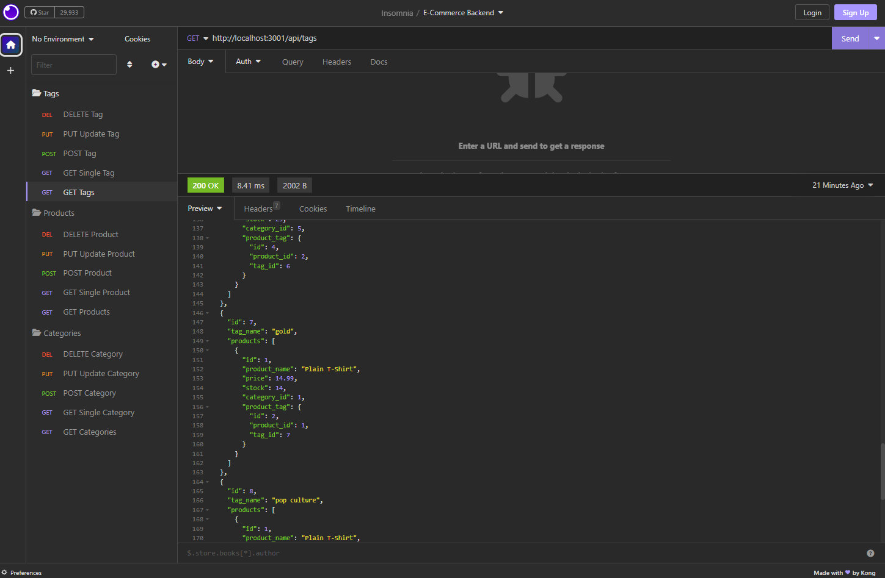

# E-Commerce Back End

## Description

This application is creating a back end for a e-commerce retail site. It uses Express.js to run crude actions with a MySQL database that is connected with Sequelize. Testing out the application with Insomnia, you'll be able to run GET, POST, PUT, and DELETE routes to the database.

## Table of Contents
  - [Installation](#installation)
  - [Usage](#usage)
  - [License](#license)
  - [Questions](#questions)

## Installation

Git clone the repository.

Please download all necessary npm packages with the below command in terminal:

`npm i `

This will install [Express.js](https://www.npmjs.com/package/express), [Dotenv](https://www.npmjs.com/package/dotenv), [MySQL 2](https://www.npmjs.com/package/mysql2), and [Sequelize](https://www.npmjs.com/package/sequelize) packages and required versions which is necessary for the application to run.

## Usage

### [Recording of Application](https://drive.google.com/file/d/1o8NwStLWbqlhbAVDs2h20t3VecXmudY8/view)

Feel free to reference the walkthrough video above for the following steps:
1. Once repo is cloned locally, the first step to run the application is to run MySQL to create the database and then seed, demonstrated in the video.

2. Once the database is created and seeded, the next step is to start the server!

                `node server.js`

3. From there, open Insomnia to test out the different routes available for each database: Categories, Products, and Tag. See the setup below of Insomnia:

## Credit

Starter code provided by University of Texas.

## License

This project is licensed under MIT. Please check LICENSE document in repository for more information.

## Questions

  If you have any questions, feel free to reach me at [GitHub](https://github.com/Annie-McElroy) or via email at [annie.mcelroy8522@gmail.com](annie.mcelroy8522@gmail.com).